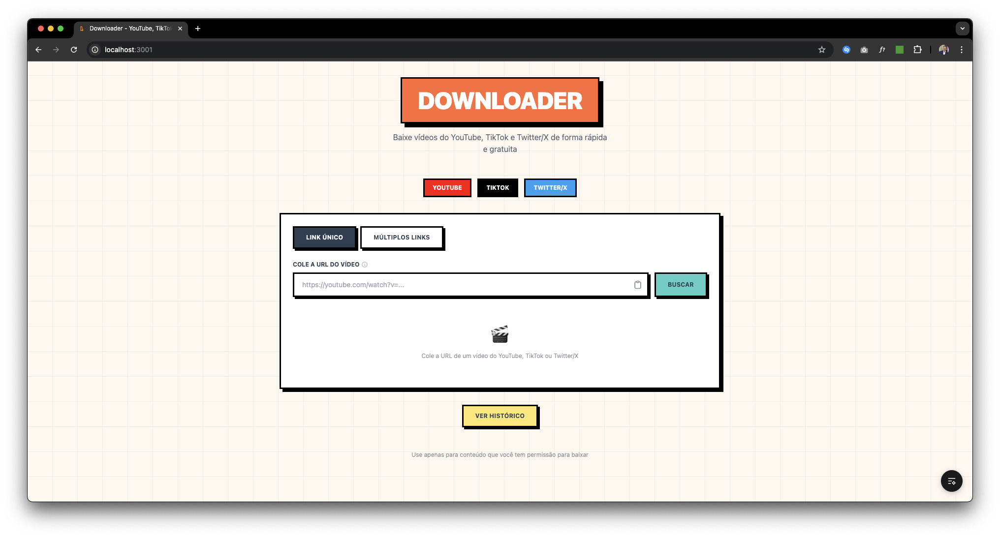
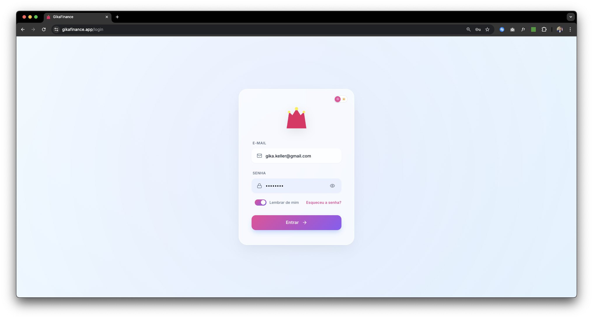

<h1 align="center">Alef Santos</h1>
<p align="center">
  <strong>Fullstack Developer</strong> · Canoas, RS
</p>

<p align="center">
  <a href="https://linkedin.com/in/alefs">
    
  </a>
  <a href="mailto:alefsantospb@gmail.com">
    
  </a>
  <a href="https://instagram.com/alefdssantos">
    
  </a>
</p>

---

### Sobre mim

Desenvolvedor Fullstack com experiência em aplicações web modernas, APIs robustas e automações. Atualmente explorando **Inteligência Artificial** e como integrar LLMs em soluções práticas.

```typescript
const alef = {
  stack: ["TypeScript", "React", "Next.js", "Node.js", "Python"],
  learning: ["Machine Learning", "LLMs", "AI Agents"],
  interests: ["Clean Architecture", "Automação", "Produtos digitais"]
};
```

---

### Tecnologias

<p>
  
  
  
  
  
  
  
</p>

---

### Projetos em destaque

<table>
  <tr>
    <td width="50%" valign="top">
      <h3 align="center">Video Downloader</h3>
      <p align="center">
        <a href="https://github.com/alefdssantos/video-downloader">
          
        </a>
      </p>
      <p align="center">
        
        
        
      </p>
      <p align="center">
        <sub>Fullstack video downloader para YouTube, TikTok e Twitter/X com arquitetura resiliente e extensão Chrome.</sub>
      </p>
    </td>
    <td width="50%" valign="top">
      <h3 align="center">GikaFinance</h3>
      <p align="center">
        <a href="https://gikafinance.app">
          
        </a>
      </p>
      <p align="center">
        
        
        
      </p>
      <p align="center">
        <sub>Sistema de controle financeiro com frontend, backend e bot de WhatsApp integrado.</sub>
      </p>
    </td>
  </tr>
</table>

---

<p align="center">
  <sub>Aberto a oportunidades e colaborações</sub>
</p>
